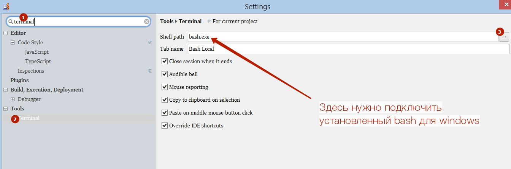
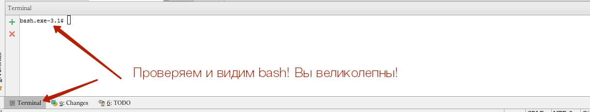
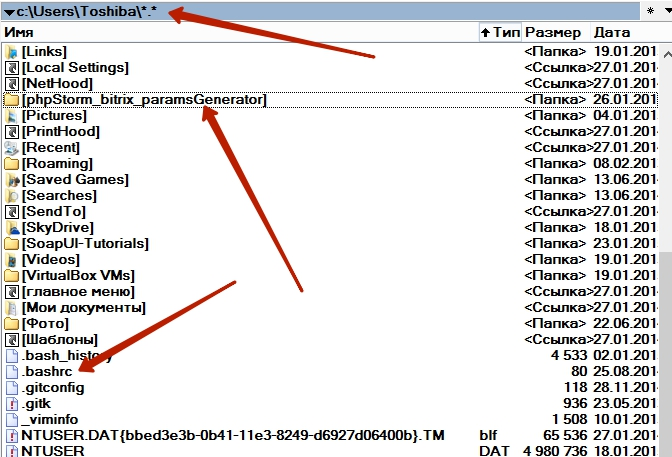

# phpStorm_bitrix_paramsGenerator

Небольшая утилита для того, чтобы в phpStorm'е автоматически генерировать .parameters.php для Битрикс
Работает криво, требует кучу дополнительных консольных утилит, на данный момент носит больше академичекий интерес.

## Подготовка к использованию

Необходимо установить bash для windows и подключить его в phpStorm в качестве основной консольной утилиты.

Bash для windows легко гуглится и берётся, например, отсюда: http://sourceforge.net/projects/win-bash/files/shell-complete/latest/

После установки, необходимо настроить phpStorm:

## Настройка bash

Как и положено bash-консоли, bash для windows поддерживает возможности файла .bashrc (этот файл выполняется каждый раз, когда Вы запускаете консоль и используется зачастую для подключения к консоли расширений)

Найдите в Вашей домашней папке файл .bashrc - скорее всего это будет что-то вида "C:\Users\Yourname\.bashrc". Если его нет - создайте.
После чего в файле пропишите:

<code>
source ~/phpStorm_bitrix_paramsGenerator/scripts/component.sh
</code>

Файлы, представленные в этом репозитории положите по соседству

Также понадобится grep, sort и другие.
К сожалению, вызовы оных на данный момент разбросаны по коду. 

## Использование

сгенерировать параметры:

<code>c params someone:news.list</code>
 
Проанализировать код компонента и сгенерировать ланг-файлы

<code>c lang someone:news.list</code>

## Чего ради все эти сложности

Ниже приведён пример того, как работает генерация параметров:

Аналогичным образом путём ввода одной команды можно получить ВСЕ lang-фразы (в компоненте и в шаблоне при этом русскоязычные фразы заменяются на вызовы GetMessage)